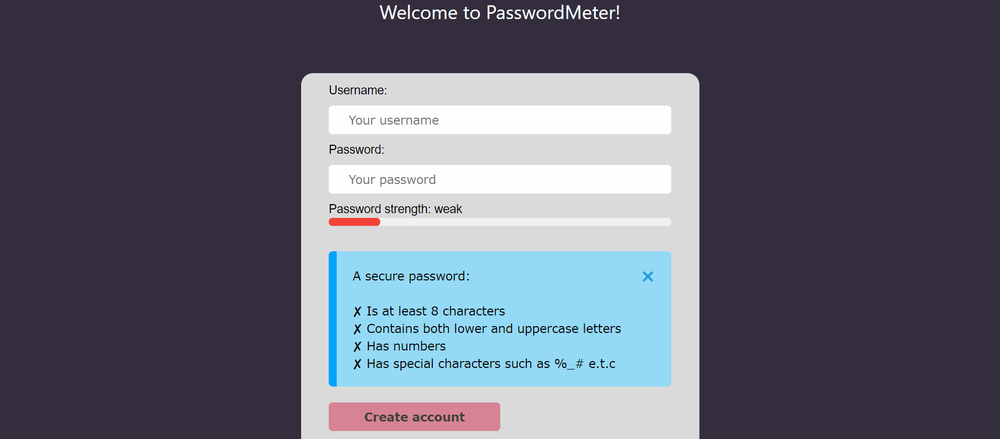

# Password_strength_meter

PasswordMeter is my first project using Javascript, HTML and CSS. This web app is a form that rates the strength of a user's password. It helps the user create a strong password by 
providing a checklist with the characteristics of a good password. The checklist authomatically updates when the user's password has a characteristic from the checklist.

